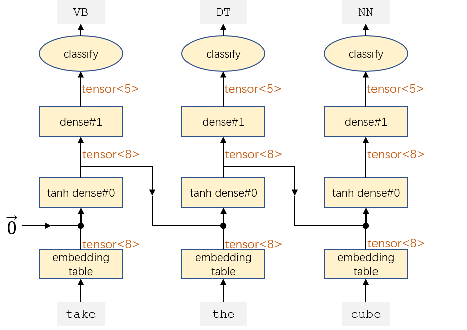
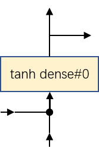
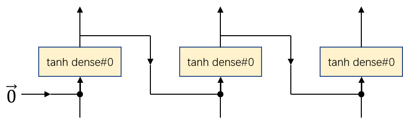
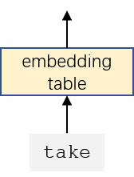
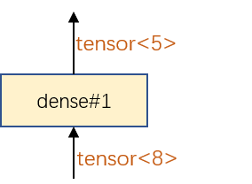
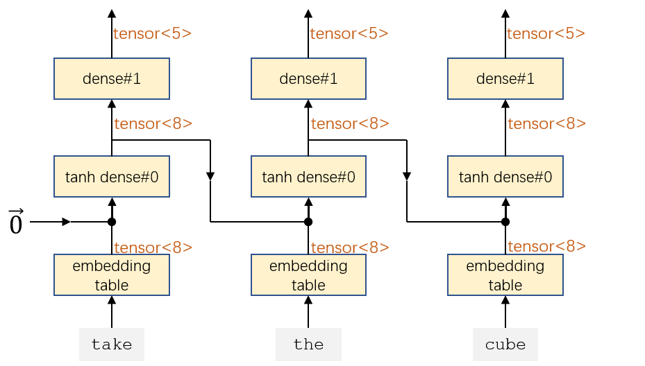
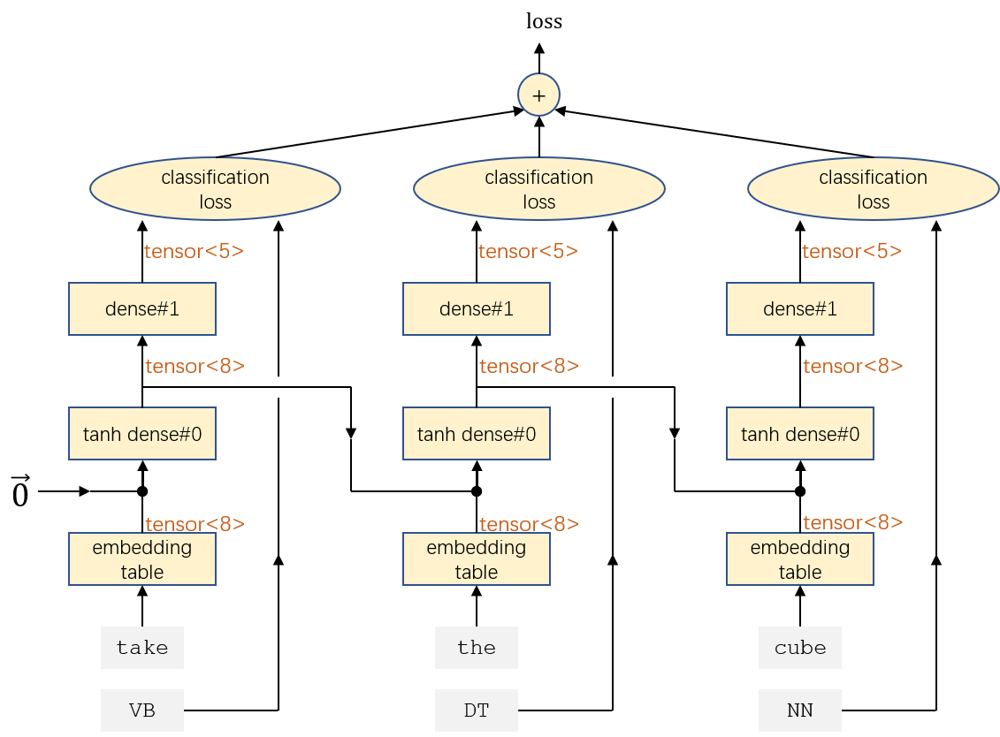

Building a naive RNN POS tagger
========

In this tutorial, we will go through how to define a naive RNN model from dense layers, and use it to build a POS tagger. Although Lego library already provides out-of-the-box implementations of various RNN models, it is very helpful to understand how to build them yourself. It is a very good opportunity to learn how to build complex models out of basic building blocks.

## The machine learning task

The task of our model is to predict POS tags of every token in a sentence. For example, the model should take an input sentence `take the red block` and output the the POS tags `VB DT JJ NN` (verb, determiner, adjective, noun).

## Design the RNN POS tagger model

Our RNN POS tagger can take a list of inputs of arbitrary length and make predictions for every item in the list. Here is a network topology of an RNN POS tagger on a sentence of 3 tokens:



The defining feature of RNN is that there is a layer that is repeatedly applied to its own output. Such repeating unit is called an **RNN cell**. In our example, the RNN cell has the following topology:



When applying the RNN cell repeatly, we get an RNN:


 
In the RNN, each repeated application is called a **timestep**. The output of the RNN cell that goes into the next timestep is called **state**. As can be seen, in this RNN the RNN cell is just a simple tanh dense layer, so it is called a **naive RNN**.


## Implementing the naive RNN cell


An RNN cell is a transducer that:
  * takes (1) the state from previous timestep, and (2) the input at current timestep
  * returns (1) the output at current timestep and (2) the state for next timestep
    * Note that in naive RNN cell, the output at current timestep and the state for next timestep are the same, but in a more general case these two doesn't have to be the same.

```cpp
constexpr unsigned long D = 8;  // D is hidden dimension
transducer_model naive_rnn_cell([&](const value_placeholder& prev_state, const value_placeholder& x)->value_placeholder {
  transducer_model tanh_dense = compose(tg::tanh, dense_structure.initialize(D + D, D));
  value_placeholder dense_out = tanh_dense(tensor_concat({prev_state, x}));

  // An RNN cell returns (1) the output at current timestep and (2) the state for next timestep.
  return make_list(dense_out, dense_out);
});

// Give this transducer a name for a more meaningful error reporting.
naive_rnn_cell.rename("RNN cell");
```

## Implementing the RNN using RNN cell


An RNN takes a list of inputs and returns a list of outputs. It should be implemented by applying the RNN cell across all timesteps, with the initial state set to zero vector.

One thing to get used to is to think in terms of **functional programming** instead of procedural programming, because functional programming is much more amenable to parallelization due to its lack of side effects. if you are thinking in terms of procedural programming, then applying the RNN cell across timesteps seems like the sort of task that requires a for-loop. However, you should not code your for-loop into the transducer model, for the following reasons:
  * It is difficult to optimize your custom for-loop
  * It is difficult for the logic of your for-loop to be saved to a model file (and port to other machines and devices)
  
### Using `list_reduce` operation
Thinking instead from a functional programming perspective, you can use **map** and **reduce** operations instead of a for-loop. For example, if you want to find the maximum value in a list, you can go through the list items one by one, keeping track of what is the current maximum value so far. Each time you encounter a list item, you compare the current maximum against the new value, and update the current maximum accordingly. In **reduce** terminology:
   * **accumulator**: the current maximum value so far.
   * **reducer**: the function that takes (1) the accumulator and (2) a new value in the list, and returns the updated accumulator
   * **initial value**: the initial value of the accumulator, should be set to -Infinity in this case.

Here is how to define the find maximum operation in Lego library:

```cpp
transducer_model find_maximum([&](const value_placeholder& xs)->value_placeholder {
  transducer_model reducer([&](const value_placeholder& accumulator, const value_placeholder& current_value) {
    // tg::cmax returns the maximum of two value
    return tg::cmax(accumulator, current_value);
  });
  return list_reduce(reducer, xs, value_placeholder::constant(-std::numeric_limits<float>::infinity()));
});

cout << find_maximum(make_list(1,4,3,2,5)) << endl; // 5
```

Armed with this tool, we can now implement the RNN with **reduce** operation. The accumulator should contain:
  1. the entire output history for each timestep encountered so far.
  2. the state for next timestep.

When encountered with a new timestep, the reducer will:
  1. compute the output for the new timestep and append it to the output history.
  2. update the state for next timestep

```cpp
transducer_model naive_rnn([&](const value_placeholder& ins)->value_placeholder {

  // The initial state is zero vector
  value_placeholder init_state = value_placeholder::zeros({D});

  transducer_model reducer([&](const value_placeholder& accumulator, const value_placeholder& in)->value_placeholder {
    value_placeholder prev_ys = accumulator[0];
    value_placeholder prev_state = accumulator[1];
    value_placeholder t = naive_rnn_cell(prev_state, in);
    value_placeholder y = t[0];
    value_placeholder next_state = t[1];

    // push_back appends a value to a list
    return make_list(push_back(prev_ys, y), next_state);
  });

  return list_reduce(reducer, ins, make_list(value_placeholder::empty_list(), init_state))[0];
});
```

## Implementing the RNN POS tagger using RNN

### Embedding table



An embedding table will turn a token (like `block`) into an embedding vector (like `-0.505133 0.813763 0.727233 0.9776 0.661954 -0.985702 0.774918 0.913759`) in such a way that tokens of similar meanings have similar embeddings and tokens of different meanings have distant embeddings. In this example, we will randomly initialize an embedding table and let it train alongside with our RNN POS tagger instead of importing from a pretrained one.

To initialize an embedding table, you need to specify the embedding vector size and the token vocabulary.

```cpp
vector<string> token_vocab{"take", "put", "the", "on", "block", "square", "circle", "cube", "cone", "red", "green", "blue"};
transducer_model symbolic_embedding_table = symbolic_embedding_table_structure.initialize(D, token_vocab);
```

Note that we call it **symbolic embedding table** instead of **embedding table** because conventionally in deep learning, an embedding table takes a token ID (integer), whereas our embedding table takes the token itself (string), so we use a different name to avoid confusions.

### Applying a transducer to a list

Our previously defined embedding table only takes a single token and output a single embedding vector. However, we need to apply it on a list of tokens and get an embedding vector for each token in the list.  


Applying some transformation for every item in the list seems like something should be achieved using for-loop. But again, instead of thinking in procedural programming, we should be thinking in functional programming. In function programming, **list map** is an operation that applies a transformation function to every item in a list. Similarly, `tg::list_map` is an operation that applies a transformation transducer to every item in a list. For example, here is how to add one to every number in a list:

```cpp
transducer_model add_one([&](const value_placeholder& x)->value_placeholder {
  return x + 1;
});

transducer_model list_add_one([&](const value_placeholder& xs)->value_placeholder {
  return list_map(add_one, xs);
});

cout << list_add_one(make_list(1,2,3)) << endl; // 4 5 6
```

### Readout layer and classification operation



A neural network usually performs classification by outputting a score for each label (in our case, `VB` `DT` `IN` `NN` `JJ`), where the bigger the score is, the more confident the label should be the output. These scores don't sum up to 1, so to make it into a **probability distribution**, we need to normalize the scores by taking the softmax. Because of this, these unnormalized scores are called **logits**, meaning "the logarithm of the odds".

Usually the logits are computed by a linear dense layer (a dense layer with no activation function). This linear dense layer is called a **readout layer**.

Let's define the readout layer:

```cpp
vector<string> postag_vocab{"VB", "DT", "IN", "NN", "JJ"};
transducer_model readout_dense = dense_structure.initialize(D, postag_vocab.size());
```

#### Classifying from logits

To get the classified label from logits, we simply output the label of the biggest logit.

To compute the classification error given logits and oracle label (desired label), we can compute the cross entropy loss: `-log(softmax(logits))[i]` where `i` is the oracle label's ID.

These two functions are implemented by the transducer factory `tg::symbolic_classify_from_logits_structure`. It will return two transducers, one outputting the predicted label and the other computing the classification loss:

```cpp
transducer_model classify, classification_loss;
std::tie(classify, classification_loss) = symbolic_classify_from_logits_structure.initialize(postag_vocab);
```

### Putting things together

With all these pieces, we can implement the RNN POS tagger. Recall from the previous [XOR model tutorial](../xor/index.md), we should factor out the logits computation part because it will be reused in the loss function. So, we implement the logits computation part:



```cpp
transducer_model compute_output_logits([&](const value_placeholder& input_tokens) -> value_placeholder {
  // Lookup the sentence into a list of token embeddings
  value_placeholder input_token_embs = list_map(symbolic_embedding_table, input_tokens);

  // Apply the RNN on the list of token embeddings
  value_placeholder rnn_outputs = naive_rnn(input_token_embs);

  // Transform the RNN outputs into logits
  return list_map(readout_dense, rnn_outputs);
});
```

Then we complete the performance component of the RNN POS tagger:


```cpp
transducer_model naive_rnn_postagger([&](const value_placeholder& input_tokens) -> value_placeholder {

  value_placeholder output_logits = compute_output_logits(input_tokens);

  // Readout the POS tags from logits
  value_placeholder output_postags = list_map(classify, output_logits);

  return output_postags;
});
```

Also, we need to implement the loss function:



```cpp
transducer_model naive_rnn_postagger_loss_fn([&](const value_placeholder& input_tokens, const value_placeholder& oracle_postags) -> value_placeholder {

  value_placeholder output_logits = compute_output_logits(input_tokens);

  value_placeholder losses = list_map(classification_loss, output_logits, oracle_postags);

  // Aggregate the loss on every predicted POS tag.
  return list_sum(losses);
});
```

Congrats! You have finished implementing the RNN POS tagger. The complete code can be found in [rnn_diy_demo.cpp](../../../src/examples/rnn_diy_demo.cpp) 
