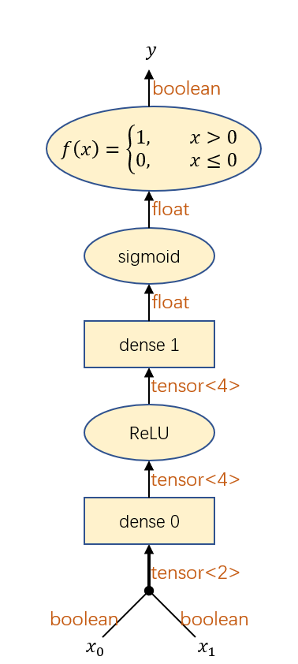

Training an XOR model
========

In this tutorial, we will go through how to build feedforward neural network consists of two dense layers, that learns the XOR function.

## Model architecture

First let's design what an XOR model consists of, by drawing diagrams with pen and paper instead of writing codes.

### Performance component 

An XOR model should contain at least two dense layers stacked together, with a hidden dimension of at least 2. But to make the model more robust, we will increase the hidden dimension to 4 to increase the likelihood of successfully training the model. Here is our model architecture:



There are a few conventions for our transducer diagrams:
  * a value is represented by an arrow
    * the type of the value is usually marked besides the arrow
  * multiple arrows merging together represents concatenation
  * one arrow splitting into multiple arrows represents copying
  * a layer (transducer with internal parameters) is represented by a rectangle
  * an operation (transducer without internal parameters) is represented by an oval

This transducer above defines how to get from the user's input to the desired output, which is called a **performance component**. The performance component is not the full picture. We also need to define how the XOR model should be trained by defining how to compute "the amount of error" given a training example. Such transducer is called a **loss function**.

### Loss function

The loss function should compute the cross entropy of the model's prediction against the oracle (golden answer). Here is the architecture for the loss function:


Note that it is important to keep the loss function differentiable w.r.t all the trainable parameters. For example, the above loss function is differentiable w.r.t the parameters in dense0, dense1. The fact that it is not differentiable w.r.t input y doesn't matter.

## Writing the model with Lego library

### Start with some boilerplate stuff

Let's start with a boilerplate C++ file
```cpp
#include <lego_transducer.hpp>
#include <iostream>
using namespace tg;
using namespace std;

int main() {
  lego_initialize();
  
  // your code goes here

  return 0;
}
```

### Define the two dense layers

Let's define the two dense layers in our XOR model. 
  * The `dense0` layer has input dimension 2 and output dimension 4.
  * The `dense1` layer has input dimension 4 and output dimension 1.

```cpp
transducer_model dense0 = dense_structure.initialize(2, 4);
transducer_model dense1 = dense_structure.initialize(4, 1);
```

Conventionally in deep learning, we tend to think of a dense layer and its activation function together as a single layer. To follow this convention, let's compose the `dense0` layer and its activation function into a single **ReLU dense** layer. So our code will instead look like this:

```cpp
transducer_model relu_dense0 = compose(relu, dense0);
```


### Defining performance component

Let's define the performance component using lambda syntax:

```cpp
transducer_model performance_component([&](const value_placeholder& x0, const value_placeholder& x1) {
  value_placeholder t = tensor_concat({x0, x1});
  t = dense1(relu_dense0(t));
  return t > value_placeholder::constant(0);
});
```

### Defining loss function

In our loss function diagram, the complex operation at the end is commonly used in binary classification problems. So Lego libary already provides a built-in transducer `tg::pickneglogsigmoid` for it.


Let's define the loss function using lambda syntax:

```cpp
transducer_model loss_fn([&](const value_placeholder& x0, const value_placeholder& x1, const value_placeholder& y) {
  value_placeholder t = tensor_concat({x0, x1});
  t = dense1(relu_dense0(t));
  return pickneglogsigmoid(t, y);
});
```

### Factor out shared parts in performance component and loss function

The performance component and the loss function shares most of the network topologies:


The shared topology can be factored out as a separate transducer. We will call this transducer `compute_logit` (why we use this funny name is beyond the scope of this tutorial). After refactoring, out code looks like this:

```cpp
transducer_model compute_logit([&](const value_placeholder& x0, const value_placeholder& x1){
  value_placeholder t = tensor_concat({x0, x1});
  return dense1(relu_dense0(t));
});

transducer_model performance_component([&](const value_placeholder& x0, const value_placeholder& x1) {
  return compute_logit(x0, x1) > value_placeholder::constant(0);
});

transducer_model loss_fn([&](const value_placeholder& x0, const value_placeholder& x1, const value_placeholder& oracle) {
  return pickneglogsigmoid(compute_logit(x0, x1), oracle);
});
```

## Train the model

### Prepare training data

A dataset is a list of data, in which each datum is just an input that your loss function expects. In this case, a datum consists of 3 booleans, `x0`, `x1` and `y`. Here is how to create such dataset with Lego library:

```cpp
auto training_set = create_transducer_dataset(3); // each datum contains 3 values
training_set->emplace_back(0,0,0);
training_set->emplace_back(0,1,1);
training_set->emplace_back(1,0,1);
training_set->emplace_back(1,1,0);
```

### Choose an optimizer

There are various gradient based optimization algorithm available, like simple SGD or Adam. In this case, we will use simple SGD optimizer for simplicity because this is the most basic optimizer. We will use a bigger learning rate than default because the training set is very small.

```cpp
simple_sgd_optimizer optimizer(0.01);
```

### Setup training pipeline

During training, you need to take care of many details like batching the dataset, spawning multiple workers, reporting progress, validating against validation set etc. To make things easier, Lego library provides a standard pipeline (what we called a **training pipeline**) for all these works. Here is how to use the training pipeline:

```cpp
training_pipeline trainer(&optimizer);
trainer.set_num_epochs(1000);
trainer.train(loss_fn, training_set);
```

### Saving and loading

After training, you should save the XOR model (both the performance component and the loss function) into a file. 

```cpp
transducer_model::save_to_file("model.bin", performance_component, loss_fn);
```

Note that you need to save them into a single file instead of saving them separately into two different files. Otherwise, when loaded back, they will each have their own copy of `dense0` and `dense` parameters instead of having shared ones.

You can load the model back:

```cpp
transducer_model loaded_performance_component, loaded_loss_fn;
transducer_model::load_from_file("model.bin", loaded_performance_component, loaded_loss_fn);
```

### Test your model

Now test the loaded model by giving it some input:

```cpp
cout << loaded_performance_component(0,0) << endl;
cout << loaded_performance_component(0,1) << endl;
cout << loaded_performance_component(1,0) << endl;
cout << loaded_performance_component(1,1) << endl;
```

Congrats! You have finished writing the XOR model. You can now try to compile and run it.

The full code can be found in [xor_demo.cpp](../../../src/examples/xor_demo.cpp)
